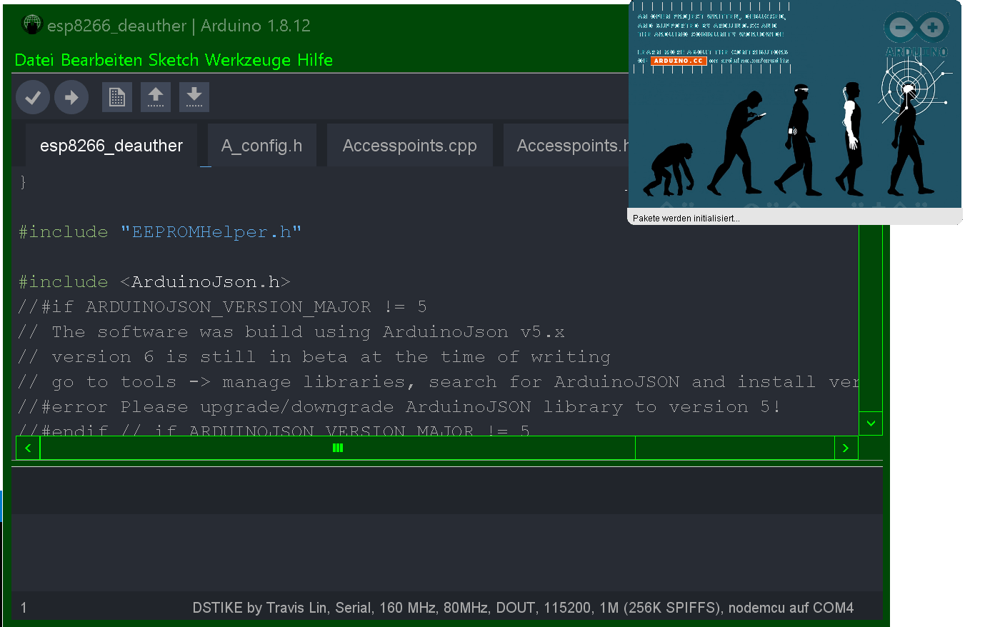

</img>
# ARDUINO-IDE-EX
Extension Projekt for ARDUINO IDE (1.8.12) |Modding|Theming|Styling|

Copy Content of ARDUINO 1.8.12 in your installation folder.
</img>
 <table>
  <tr>
    <th>Add URL`s </th>
 </tr>
  <tr>
  <td>http://arduino.esp8266.com/stable/package_esp8266com_index.json</td>
  </tr>
  <tr>
  <td>https://raw.githubusercontent.com/espressif/arduino-esp32/gh-pages/package_esp32_index.json</td>
  </tr><tr>
  <td>https://raw.githubusercontent.com/wiki/tobozo/Arduino/package_deauther_index.json</td>
  </tr>
</table>
</img>
